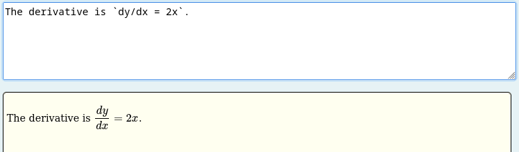
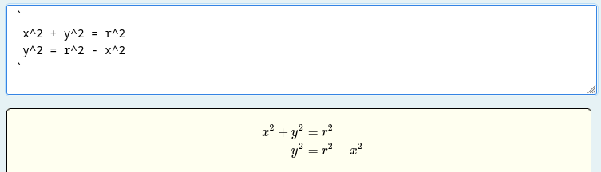
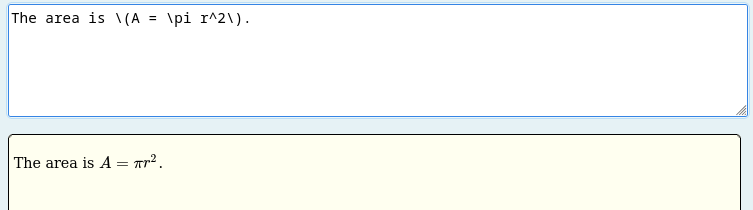
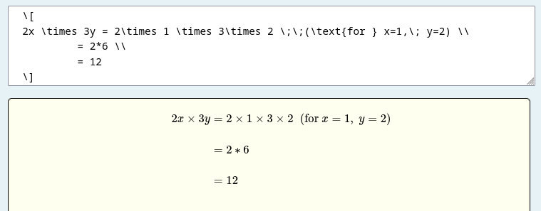

# ASCII block

This block has two purposes:

1. to process and display the contents of a [free-text input](../Inputs/Text_input.md) using client-side Javascript to process markdown, AsciiMath and LaTeX (etc).
2. to extract information from the text (as it is processed) and link that to another STACK input.

Examples of how to use this block are given in the [free-text specialist tools](../../Specialist_tools/Free_text_input/index.md) documentation.

The `[[ascii]]` block takes one or more optional `[[filter]]` child block and one or more optional `[[extractor]]` child blocks. This example links free-text input `ans1` to another input `ans2`:

```
[[ascii input="ans1"]]
[[filter type="markdown" transforms="latexwrap" /]]
[[extractor type="lastexpr" targetinput="ans2" /]]
[[/ascii]]
```
The student's text is run through a markdown filter first which applies normal markdown display formatting and also the special STACK transformation which translates and aligns AsciiMath surrounded by backticks.

Multiple `[[extractor]]` blocks may be used to extract answers from the block into multiple STACK inputs. Multiple `[[filter]]` blocks can also be used to translate the raw original input in different ways in succession. By default, the output of one filter is fed into the next filter as the 'raw' input. Extractors are supplied with the cumulative output of the filters so far and 'map' information from the most recent filter applied. For instance, the markdown filter supplies a list of all the identified occurences of code and asciimaths sections in the student's text (in order) and with both the initial contents given to the filter and the transformed output.

Filters and extractors are applied in the order listed in the `[[ascii]]` block. Filters have the option to break the chain and return to processing the initial raw student input and/or to display the output of the current filter even if there are later filters in the chain (which will thus be used for creating input for extractors, not display).

Currently, it is only possible to link one source input.

### Block parameters

Functionality and styling can be customised through the use of block parameters.

1. `input` (required): string. The name of the free-text input which provides input to this block.
2. `height`: string containing a positive float + a valid CSS unit (e.g. `"480px"`, `"100%"`, ...). Default is `"400px"`. This fixes the height of the display window.
3. `width`: string containing a positive float + a valid CSS unit (e.g. `"480px"`, `"100%"`, ...). Default is `"100%"`. This fixes the width of the display window.
4. `aspect-ratio`: string, containing a positive float. This can be used with `height` _or_ `width` (not both) and automatically determines the value of the un-used parameter. An error will occur if values for both `width` and `height` are also set.
5. `hidden`: To hide the display of the contents use the block option `hidden="true"`.


## Filters

Filters control how the student's text input is processed and displayed. If no `[[filter]]` block is provided, the default `markdown` filter with transforms `latexwrap,boldfilter` is applied automatically.

A filter is specified with a `[[filter]]` child block inside the `[[ascii]]` block:

```
[[ascii input="ans1"]]
[[filter type="markdown" transforms="latexwrap" /]]
[[extractor type="lastexpr" targetinput="ans2" /]]
[[/ascii]]
```

### Filter block parameters

1. `type` (required): the filter type. Currently available: `markdown`, `calculation`.
2. `transforms` (for `markdown` type): a comma-separated list of transforms to apply. Available transforms: `latexwrap`, `boldfilter`.
3. `reset`: if `"true"`, this filter operates on the original raw input rather than the output of any preceding filter.
4. `display`: if `"true"`, the output of this filter is used as the final display and subsequent filters cannot modify the display.

### Available filters

#### `markdown`

The `markdown` filter processes the student's text as Markdown and renders mathematical content. The following rendering rules are applied to recognised token types:

- **`code_inline`**: A single backtick expression is treated as inline AsciiMath. The content is converted to LaTeX by `AMparseMath` and wrapped in `\(...\)`.

  ```
  The derivative is `dy/dx = 2x`.
  ```


- **`asciimath_block`**: A backtick on its own line opens a multi-line AsciiMath block; another solitary backtick closes it. Each line of content is converted to LaTeX by `AMparseMath` and any configured transforms are applied.

  ```
  `
  x^2 + y^2 = r^2
  y^2 = r^2 - x^2
  `
  ```


- **`math_inline`**: Inline LaTeX delimited by `\(...\)` or `$...$` (via the `tex` extension) is passed through as-is and wrapped in `\(...\)`.

  ```
  The area is \(A = \pi r^2\).
  ```


- **`math_block`**: Display LaTeX delimited by `\[...\]` or `$$...$$` is passed through and any configured transforms are applied.

  ```
  \[
  2x \times 3y = 2\times 1 \times 3\times 2 \;\;(\text{for } x=1,\; y=2) \\
           = 2*6 \\
           = 12
  \]
  ```


Available transforms (specified via the `transforms` parameter):

- `latexwrap`: Formats multiple-line mathematics aligned on the first `=` sign, or similar operators such as inequality. (Shown in math_block and asciimath_block examples above.) The lines of a LaTeX expression are arranged in a 3-column aligned layout:
  - col 1 – leading implies/therefore symbol (if present, e.g. `\Rightarrow`, `\therefore`)
  - col 2 – left-hand side up to (but not including) the relation symbol
  - col 3 – relation symbol and right-hand side

  A `\text{…}` that is not `\text{or}`, `\text{and}`, or `\text{if}` is pushed into a 4th column.

- `boldfilter`: Changes each mathematical expression to bold. Must be applied after `latexwrap` (use `transforms="latexwrap,boldfilter"`). This is a temporary addition for testing purposes.

#### `calculation`

The `calculation` filter finds text enclosed in `@` characters on a single line and renders it in bold. For example, `The answer is @x^2 + 1@ here` displays **x^2 + 1** in bold. The enclosed text is also collected as a block and available to the `lastcalc` extractor. Eventually this will actually do the calculation but is currently included for testing purposes.

### Filter developer notes

Filters are defined in `corsscripts/ascii/filters`. This has been designed to add flexibility for filtering. Markdown transforms and associated shared functions are in `corsscripts/ascii/markdownittransforms`. Markdown extensions for identifying additonal document sections are in `corsscripts/ascii/markdownitextensions`. The rules for how to display these sections are in `corsscripts/ascii/filters/markdownitextensions.js`.

## Extractors

The purpose of "extractors" is to identify parts of the student's text, extract this, and send it to another STACK input for automatic assessment. An extractor is specified with a self-closing `[[extractor]]` child block inside the `[[ascii]]` block. Multiple `[[extractor]]` blocks may be used to link to multiple STACK inputs.

### Extractor block parameters

1. `type` (required): the extractor type. See available types below.
2. `targetinput` (required): the name of the STACK input which receives the extracted value.
3. `regex`: a JavaScript regular expression string. Required for the `regexmatch` and `regexall` types. (Backslashes in the regex need to be escaped with an additional backslash.)

### Available extractors

#### `lastexpr`

Returns the trimmed content of the last inline AsciiMath expression (delimited by backticks), or the last non-empty line of the last multi-line AsciiMath block, in document order. Falls back to the final non-empty line of the raw input when no blocks are present.

```
[[extractor type="lastexpr" targetinput="ans2" /]]
```

#### `lastblock`

Returns the raw content of the last inline AsciiMath expression, or the _full content_ of the last multi-line AsciiMath block. This option relies on having a multi-line STACK input such as `equiv` or `textarea` to receive the potential multi-line expression.


```
[[extractor type="lastblock" targetinput="ans2" /]]
```

#### `lastcalc`

Returns the trimmed content of the last `calculation` block (i.e. text enclosed in `@...@`). This needs to come directly after the `calculation` filter.

```
[[extractor type="lastcalc" targetinput="ans2" /]]
```

#### `finalfunction`

Scans blocks bottom-up for the last expression matching `f(x) = <expr>` and returns `<expr>`.

```
[[extractor type="finalfunction" targetinput="ans2" /]]
```

#### `regexmatch`

Scans blocks bottom-up for the last inline AsciiMath expression or last line of a multi-line block matching the given regular expression, and returns the matched line. The `regex` parameter is required. The target input could be a Maxima input (e.g. algebraic) or STACK's string input.

```
[[extractor type="regexmatch" targetinput="ans2" regex="^f\\(x\\)\\s*=\\s*" /]]
```

Note the escaped backslashes: in the `regex` attribute value `\\(` represents the regular expression `\(` which matches a literal `(`.

#### `regexall`

Searches the entire raw input for all lines matching the given regular expression and returns a JSON object `{"matches": [...]}` as a string. The `regex` parameter is required. The target input should be a string or JSON input. (Choose JSON for better debugging.)

```
[[extractor type="regexall" targetinput="ans2" regex="fruit" /]]
```

If the result is assigned to input `ans2`, you can create a Maxima list of the matched strings with:

    sa1: stackmap_get(stackjson_parse(ans2), "matches");

in the feedback variables.

### Using extractors with regular expressions

Imagine we are expecting a student to conclude with
```
`f(x) =  <expr> ` 
```
and we wish to assess their answer `<expr>` in a PRT automatically.

One way to do this is to use the `finalfunction` extractor:

```
[[ascii input="ans1"]]
[[extractor type="finalfunction" targetinput="ans2" /]]
[[/ascii]]
```

Another way is to use a client-side regular expression with `regexmatch`:

```
[[ascii input="ans1"]]
[[extractor type="regexmatch" targetinput="ans2" regex="^f\\(x\\)\\s*=\\s*" /]]
[[/ascii]]
```

This sends only the matched expression to the input. The validation message will show "Your last answer ..." with only `expr` validated.

Alternatively, send _everything_ to the input (e.g. `ans1`) and post-process in the PRT feedback variables:

    sa1: if equationp(ans1) then rhs(ans1) else ans1;

If `ans1` is an equation, this takes the right-hand side of `ans1`, or the whole expression otherwise. This approach condones lack of `f(x)=` in a student's answer or them using something else.

Both client-side regular expressions and post-processing in Maxima have their merits and uses and so we suppport both options for teachers.

#### Extracting multiple strings using regular expressions


If use the `regexall` extractor and have a regular expression which matches "fruit" within the student's answer (!), then the expected output will be in the form:

    "{\"matches\":[ \"Apple\", \"Bannan\", \"Cherry\"]}";

If this is assigned to input `ans2`, then you can create a Maxima list of the matched strings with `sa1: stackmap_get(stackjson_parse(ans2), "matches");` in the PRT.

### Extractor developer notes

Extractors are defined in `corsscripts/ascii/extractors`. (In the future we may add more flexible functionality, linking arbitrary extractors to multiple inputs.)

